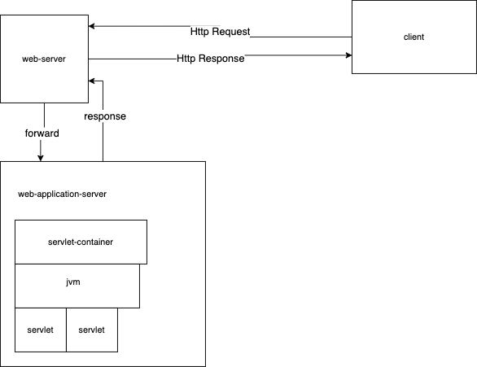

# jwp-basic-custom

## Memo
request.forward 를 하면 현재의 url 이 변경되지 않는다.  
href 등으로 로직이 이어질 것 같으면, sendRedirect 로 현재 url 을 갱신해주어야 한다.  
 
tomcat 이 root path 에 반환하는 view(html, htm, jsp) 를 welcomeFile 이라고 칭해진다. 
 기본적으로 web.xml 에 설정하지 않는다면, tomcat 은 root 위치에 index.html > index.html > index.jsp
 순서로 확인하여 있으면 반환한다.
 > 이 과정을 찾는 것이 오래 걸렸다. default 값이어서 tomcat 코드까지 파고 들어가야 한다. 그래서 global web.xml 을 두는 것이 명시적이어서 좋아보인다. 

## requestDispatcher

## servlet
웹 페이지에서 사용자가 필요한 자료를 동적으로 반환하기 위해 고안된 자바 프로그램
필요한 자료에 응답하기 위해 연산하는 역할을 담당

### servlet container 

#### 동작 순서
* 웹서버와 서블릿이 소켓 생성하여 통신 가능하게 함
* HttpServletRequest, HttpServletResponse 객체를 생성  
* 사용자의 요청이 들어오면 해당되는 서블릿을 찾아서 서블릿의 service() 호출
* 서블릿이 연산한 내용을 HttpServletResponse 에 담아서 사용자에게 응답
* HttpServletRequest, HttpServletResponse 객체를 소멸

#### 역할
* 실제로 소켓을 만들고, 연결하는 로직 구현 
  * 개발자가 비지니스 로직에 집중할 수 있게 함
* 서블릿의 생명 주기를 관리
* 멀티 쓰레드 지원 및 관리

#### @WebServlet loadOnStartup
서블릿은 사용자에게 처음 요청이 왔을 때 생성 및 초기화
하지만, 사용자 요청과 관계없이 서블릿을 메모리에 로드하고 싶을 때 주는 옵션
(e.g. loadOnStartUp = 1)
할당된 숫자가 낮을 수록 먼저 생성

#### user dao refactoring
하나의 클래스는 한 가지 역할만 해야한다 라는 의미를 알 것 같다
리팩토링을 하다보니 느꼈는데, 한 가지 역할만 하도록 코드를 설계하게 되면 코드 리팩토링을 하기에 굉장히 집중도 있게 할 수 있다
한 가지, 특정 부분만 리팩토링을 하면 되기 때문에,

그러한 설계를 가져갈 수 있도록 고민하는 습관을 들여서 코드를 짠다면, 이 코드가 유지보수, 운영되기에 굉장히 쉬워질 것 같다

#### static 과 singleton 의 차이

#### @SuppressWarnings("rawtypes") ?

#### @FunctionalInterface
 익명 클래스를 만드는 대신에 람다를 사용할 경우 인터페이스의 메소드가 하나만 존재햐아 한다.
 또한, 람다 표현식으로 사용할 인터페이스라고 지정하려면 인터페이스에 @FunctionalInterface 애노테이션을 추가해야 한다.
 
## Tips
 if/else 문이 반복되는 문제를 해결하고 싶다면, 인터페이스를 추가하여 해결할 수 있음